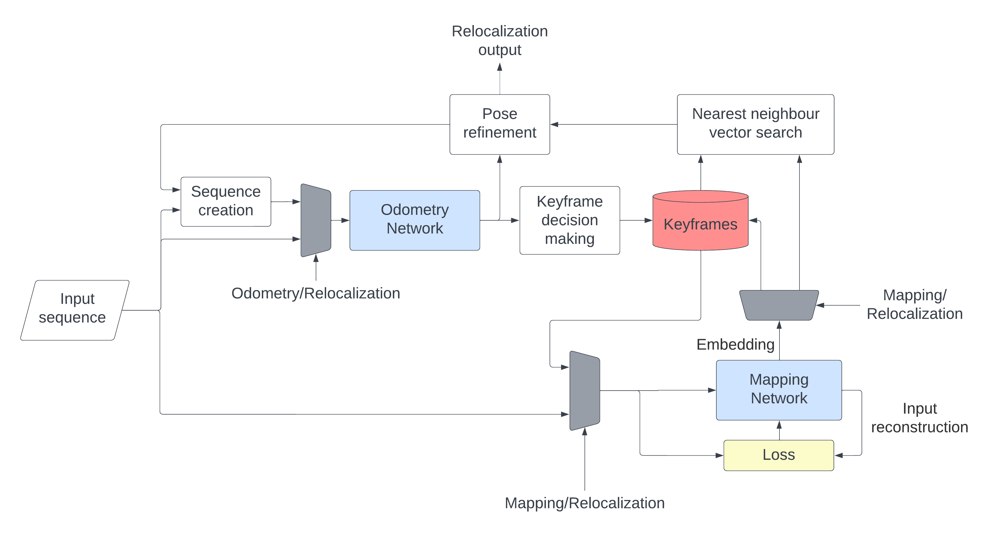

# ATDN vSLAM
This is the implementation of the ATDN vSLAM algorithm ([paper](https://pp.bme.hu/eecs/article/view/20437)) that is an all-through Deep Learning based solution for the vision based Simultaneous Localization and Mapping (SLAM) task.



In case you are using this work please cite our paper:
```bibtex
@article{Szanto_Bogar_Vajta_2022, 
    title={ATDN vSLAM: An All-Through Deep Learning-Based Solution for Visual Simultaneous Localization and Mapping},
    volume={66},
    url={https://pp.bme.hu/eecs/article/view/20437},
    number={3},
    journal={Periodica Polytechnica Electrical Engineering and Computer Science},
    author={Szántó, Mátyás and Bogár, György Richárd and Vajta, László},
    year={2022},
    pages={236–247}
}
```

## Prerequisites
1. Clone the repo and go to its library
```bash
git clone https://github.com/MILAB-IIT-CV/ATDN_vSLAM.git
cd ATDN_vSLAM
```
2. Clone the [GMA](https://github.com/zacjiang/GMA) optical flow library: Used for Deep Learnig based flow estimation
```bash
git clone https://github.com/zacjiang/GMA
```
3. After that ATDN vSLAM and its dependencies can be installed locally via
```bash
pip install -e .
```


### Config

 Before using the SLAM, a config.yaml file is required in the utils folder. Here is an example what it should contain:
 ```yaml
!!python/object:utils.arguments.Arguments
alpha: 1
batch_size: 24
data_path: /path/to/dataset
device: cuda:0
epochs: 1
epsilon: 1.0e-08
keyframes_path: /path/to/SLAM/output
weight_file: checkpoints/clvo_generalization4_
log_file: loss_log/generalization4_
lr: 0.01
stage: 1
sequence_length: 6
train_sequences:
- '00'
- '01'
- '02'
- '03'
- '04'
- '06'
- '08'
- '09'
- '10'
wd: 0.001
augment_flow: false
precomputed_flow: true
w : 2

 ```
## Usage

For a detailed introduction to the system usage, please check our [tutorial](utils/tutorial.md).
